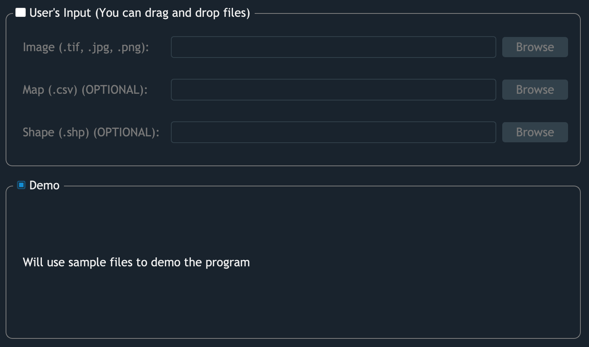

First-Time Users
================

Learning a new thing could sometimes be a tough thing to do, 
but not when you deal with GRID. 
GRID aims to provide a smooth envirnoment 
for users to perform image segmentation, 
with no experience required!

Launch GRID
-----------

In the terminal:

.. prompt:: bash $

    python3 -m grid

Demo mode
---------

For the first-time users, it's recommended to use demo files. Users can start
GRID in the demo mode by choosing the option "Demo" in the
:ref:`welcome panel <Load Files>`. 

   GRID provides two ways to start the analysis, 
   the bottom one will use the demo image to proceed.
   
.. figure:: res/demo_image.png

   **Demo image**. It's recommended to define AOI over the highlighted area.

Work with your images
---------------------

GRID supports most types of :ref:`image files <Images>`, 
including GeoTiff, PNG, and JPEG. 
It's encouraged to provide a :ref:`map file (CSV) <Maps>` as well to specify 
the field layout and plot IDs. To learn how to make a valid map file,
please follow the instruction of the section :ref:`Maps`.

