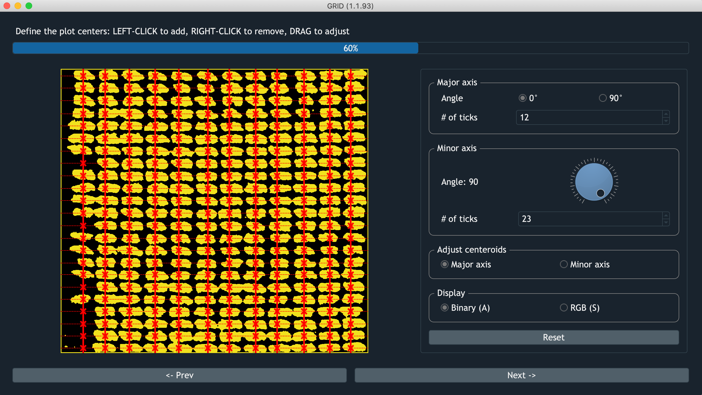
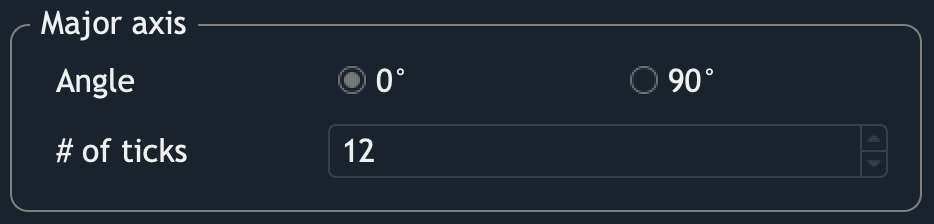
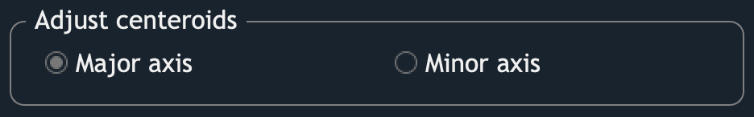

Detect Centroids
===================

    Screenshot of GRID searching centroids

After defining POI, GRID will detect the plot centroids automatically by
fitting a major axis and a minor axis to the field layout.
The interactions of two axes are the detected centroids. 
Users can furhter adjust the axes or centroids if needed.

Major axis
----------

GRID required one axis of the field layout to be 
either vertial (0°) or horizontal (90°). 
And this axis in GRID is defined as the **major axis**.

* **Angle**
    Check 0° to set the major axis in the vertical direction,
    and 90° for the horizontal direction.

* **# of ticks**
    Specify how many lines of plots follow the direction of the major axis.

Minor axis
----------

.. raw:: html

   <video width="700" autoplay loop muted>
    <source src="../_static/ct_min.mp4"/>
   </video>

|

The other axis to fit the layout is called the **minor axis**. 
This axis can be any angle that can fit the layout the best.

* **Angle**
    Rotate the spinner to specify an angle 
    between the minor axis and a vertical line. 

* **# of ticks**
    Same usage as one in the major axis. 

Centroid adjustment
-------------------------

This section allows users to adjust the position of each axis.
The checked axis will be highlighted by a thicker red line 
compared to the other axis.
Following actions are available on the highlighted axis:

* **Move**
    Left-click and drag on any lines to move.

* **Add**
    Left-click on an area not occupied by any line.

* **Delete**
    Right-click on a line you want to delete