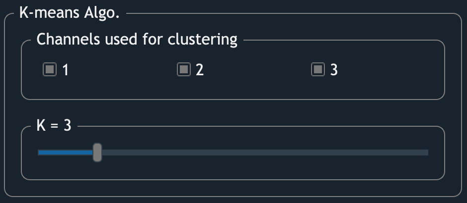
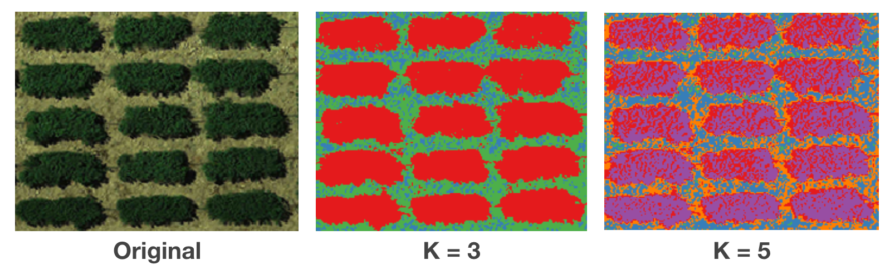
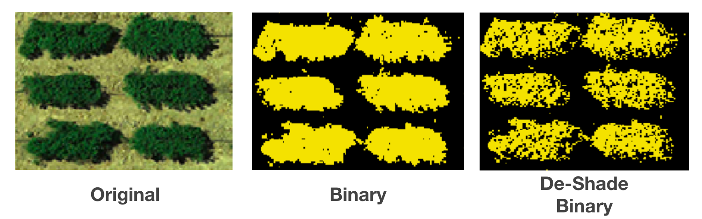
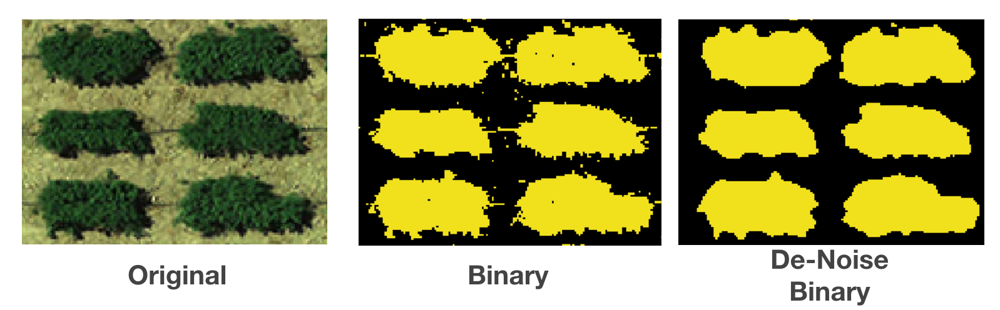
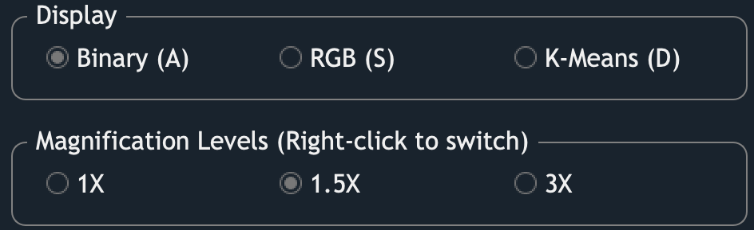
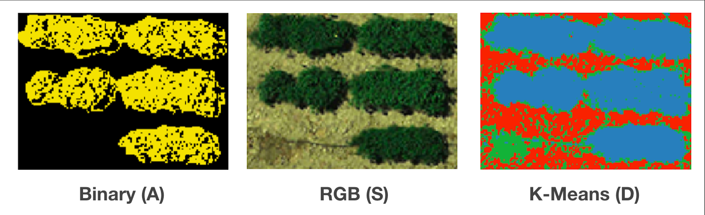

Define POI
==================

.. figure:: res/km_pn.png

    Screenshot of GRID defining POI

In this step, 
GRID will help users to extract pixel of interest (POI) from the AOI.
POI is colored in yellow, whereas the remaining areas are shown as black pixels.
Pixels contain soil, non-vegetation objects, 
and field residuals can be excluded in this step. 
There're also refining tools avaialble to remove shadow and image noise

K-Means clustering algorithm
----------------------------

   The interface of K-means clustering algorithm

GRID uses K-means clustering algorithm to cluster imagery pixels.
Two parameters are available to be tuned:

* **Channels used for clustering** 
    By checking the box, the corresponding channel will be included 
    in the feature space for clustering.
    The checkable boxes are imagery channels found from the inputs.
    For example, in a JPEG image, "1" is the red channel, 
    which should also be the first channel of a JPEG image.

* **K**
    It's how many clusters expected to exist in the image. 

    Comparison between the raw image, 3-cluster image, and 5-cluster image.

Binarization
------------

.. raw:: html

   <video width="700" autoplay loop muted>
    <source src="../_static/poi_bin.mp4"/>
   </video>

|

This section allows you to assign which clusters belong to POI. 
The image will then be binarized into a yellow/black image 
showing POI and non-POI, respectively. Two ways to do the binarization:

* **Auto cutoff**
    GRID will rank clusters based on the possibility of being POI.
    When auto cutoff = **m**, 
    the first **m** cluters will be assigned to AOI (yellow).

* **Custom**
    You can also assign POI in the original order of clusters 
    (which usually is arbitrary from K-means clustering algorithm). 
    The checked box will be assign to POI.

Refine POI
-----------

.. raw:: html

   <video width="700" autoplay loop muted>
    <source src="../_static/poi_refine.mp4"/>
   </video>

|

* **De-Shade**
    Even though most orthoimages are taken around noon, 
    which is a time that has minimum shaded area,
    there're still some cases that shaded areas are observed in the image.
    These type of areas usually have lower brightness and spectral reflectance.
    Exclude such areas can improve the quality of the evaluation on each plot.

* **De-Noise**
    It's inevitable to include non-vegetation objects in the image.
    Pipes for irrigation system, 
    or field residuals can sometimes look similar to your evaluated subjects.
    To exclude them, GRID provide a gaussian filtering approach 
    to remove such noise.

Display/Zoom
------------

Different display modes can help users to validate the result. 
Users can hover the cursor on the image to zoom in certain areas.
And use the keys ``A``, ``S``, and ``D`` 
to switch between different display modes
in order to evaluate whether the extracted POIs are valid. 

