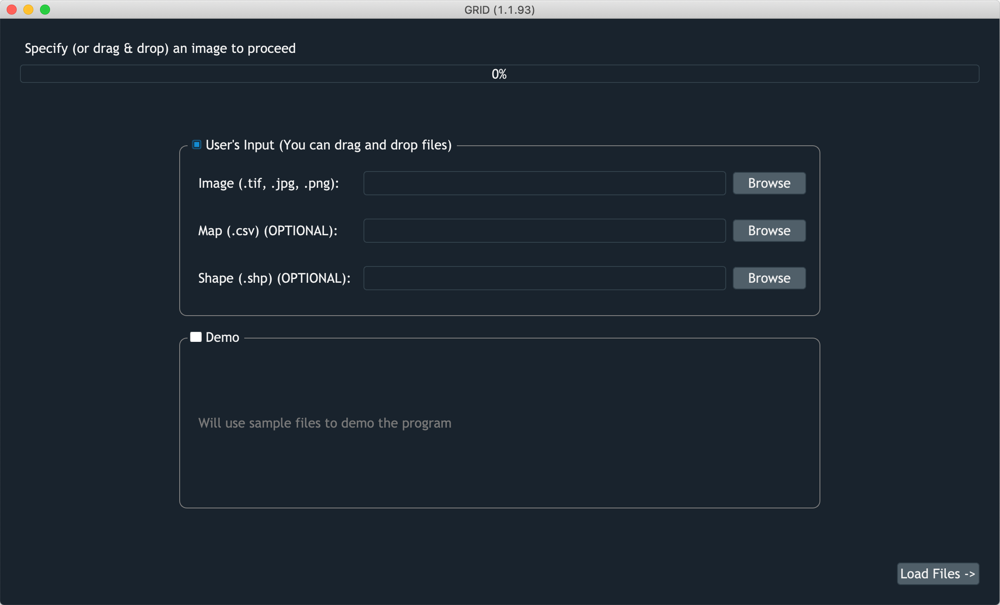

Load Files
==========

It's the first panel you'll see in GRID. 
The top option allows you to load your own image, field layouts, and shapefiles.
And the bottom option will load an example image for you to explore GRID.

    Screenshot of GRID taking inputs

Input files
-----------

* **Iamge**
    It's a required input in GRID. Load an image you want to work on. 
    GeoTiff, regular Tiff, PNG, and JPG are supported.

* **Map**
    It's optional to provide a map file. 
    It can help GRID to know how many rows and columns exist in the image,
    also providing plot IDs in order to track your plots better. 
    To learn how to provide a valid map file, go to this :ref:`section<Maps>`.

* **Shape**
    It's another optional input. 
    By loading a shapefile, GRID can replicate plot positions 
    learned from the previous image to the current one. 
    This feature is specificaly designed for a situation when you have multiple 
    images taken in different seasons. 
    A detailed tutorial is shown in this 
    :ref:`section<Multi-Season Images>`.

Drag and drop
-------------

Don't like the "browse button"? 
No worry, you can drag and drop files directly from your folders

.. figure:: res/ld_dnd.gif

    Drag-n-drop feature in GRID 

