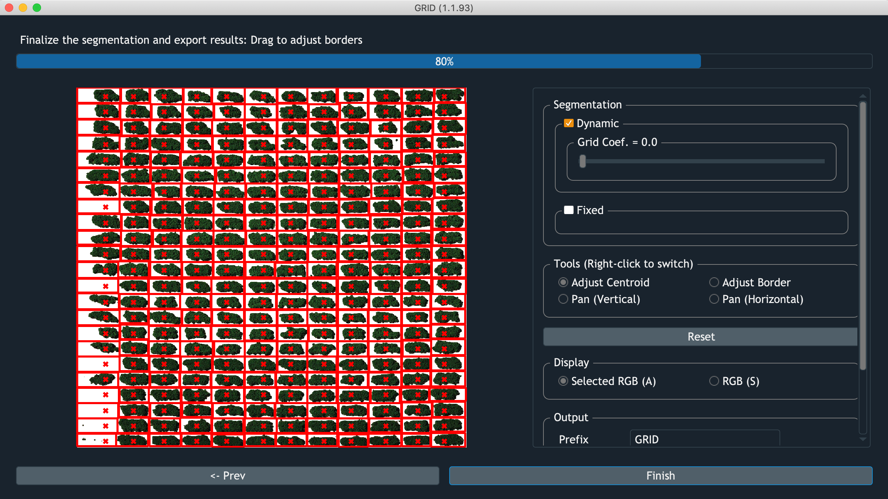
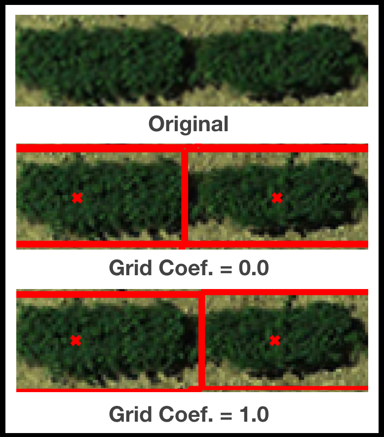
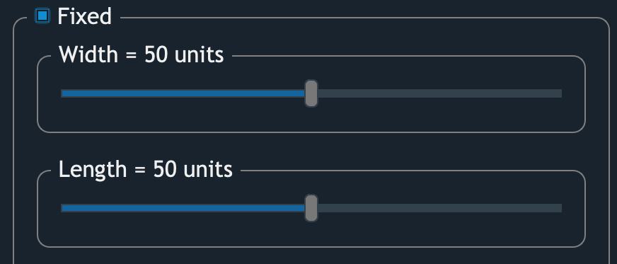
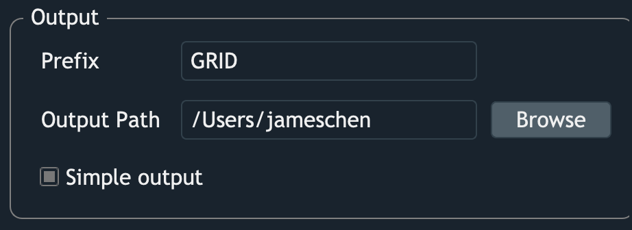

Segmentation
============

    Screenshot of GRID performing segmentation

Dynamic
-------

GRID infers plot boundaries based on the POI distribution.
The only tunable parameter ``Grid Coef.`` is how much weight should be put 
on the global layout over local pattern.
For example, when the boundary between two adjacent plots are ambiguous,
``Grid Coef. = 0.0`` would encourge plot with more connected POI to 
agressively expand its border. 
Whereas ``Grid Coef. = 1.0`` would let both of their borders to follow
the pattern from other rows/columes.

Fixed
-----

If the option ``Fixed`` is checked, 
plots will be assigned boundaries with an equal size.
The size of **units** is obtained from:

.. math::
 
    \text{1 unit} = 
    \frac{\text{Image size}}{\text{Number of plots}} * \frac{1}{100} 

For example, if an input image is 1,000 pixels wide, 
and there're 10 columns of plots.
1 **unit** then become 1 pixel wide.
In this case, assigning 50 **units** width to the plots meaning 
each plot would has 5 pixel wide boundary. 
And when ``width = 100 units``, 
plot boundaries should horizontally occupy the entire image. 

Fine-tune results
-----------------

.. raw:: html

   <video width="700" autoplay loop muted>
    <source src="../_static/seg_adj.mp4"/>
   </video>

|

GRID provides several ways to fine-tune the segmentation results:

* **Move centroids**
    Left-click and drag within the plots to move the centroids

* **Resize borders**
    Left-click and drag at **the inner side** of the border to resize it.

* **Row positions**
    Left-click and drag at any row of plots to move the entire row.

* **Column positions**
    Left-click and drag at any column of plots to move the entire column.

Export results
--------------

* **Prefix**
    GRID will create a folder for placing the outputs. 
    The name of this folder is the specified ``Prefix``, 
    and all the output filenames will start wtth the ``Prefix``.

* **Output path**
    A path where you want the outputs to be saved

* **Simple output**
    By checking this option, only basic results will be saved.
    There's further discussion in this `section <Outputs>`
