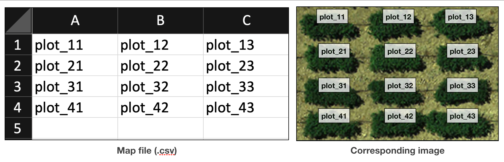

Inputs
======

Images
------

GRID supports most of common formats, 
including ``.tif``, ``.jpg``, and ``.png``

.. note::
    Currently, GRID supports images with up to **9 spectral channels**.
    The exceeded channels would be ignored in the K-means clustering process,
    and it may also affect the performance.

Maps
----

This is an optional input to tell what's the field layout in the image.
It's a simple ``.csv`` file, requiring no header nor row names.
Simply put the plot names based on how they are grown in the field,
and GRID can output results along with these given IDs.

Shapefiles (inputs)
----------------------

The shapefile has to be obtained from GRID to be a valid input.
It's an optional file allows GRID to replicate plot boundaries 
rom the previous analysis in GRID. 
You can learn the details in this :ref:`section<Multi-Season Images>`.

