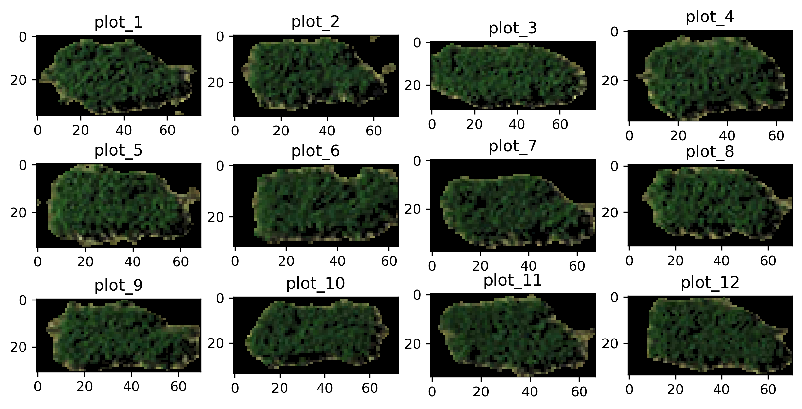

Outputs
=======

Tabular results
---------------

Extracted information for each plot is presented in a ``.csv`` file.
Below we will list the definition of each field:

* **var**
    Variety names, which are the IDs learned from the map file.
    ID will be "unnamed_xx" instead if there's no map file provided.

* **row**
    Count from the toppest row of plots.

* **column**
    Count from the leftest column of plots.

* **area_all**
    Number of pixels in the segmented rectangle (red boundaries).

* **area_veg**
    Number of POI

Vegetation indices are represented by the averaged value of the POI,
and ``xxx_std`` is its corresponding standard deviation. 
Below are the formula of each index, 
the x\ :sup:`th`\  band will be labeled as b\ :sub:`x`\  :

* **Normalized Difference Vegetation Index (NDVI)**
    .. math:: 

        NDVI = \frac{(b_4 - b_1)}{(b_4 + b_1)}

* **Green Normalized Difference Vegetation Index (GNDVI)**
    .. math:: 

        GNDVI = \frac{(b_4 - b_2)}{(b_4 + b_2)}

* **Combination of Normalized Difference Vegetation Index (CNDVI)**
    .. math:: 

        CNDVI = \frac{(2 * b_4 - b_1 - b_2)}{(b_4 + b_1 + b_2)}

* **Ratio Vegetation Index (RVI)**
    .. math:: 

        RVI = \frac{b_4}{b_1}

* **Green Ratio Vegetation Index (GRVI)**
    .. math:: 

        GRVI = \frac{b_4}{b_2}

* **Normalized Difference Greenness Vegetation Index (NDGVI)**
    .. math:: 

        NDGVI = \frac{(b_2 - b_1)}{(b_2 + b_1)}

The channel values are recorded in this output as well. 
The **averaged value** of the x\ :sup:`th`\  channel and 
its **standard deviation** will be stored 
in the column of ``ch_x`` and ``ch_x_std``, respectively.

Images for validations
----------------------

Several images are exported for users to validate the results.
The title of each sub-figure is its suffix:

* **Checked** :ref:`Simple output <Export results>`:

    .. figure:: res/ck_out.png
        :align: center

* **unchecked** :ref:`Simple output <Export results>`:

    .. figure:: res/unck_out.png
        :align: center

Shapefiles (outputs)
----------------------

The shapefile is generated by the Python package 
`PyShp <https://github.com/GeospatialPython/pyshp>`_ .
Each record represent a segmented plot, 
containing coordinates of boundaries
and all the attributes listed in the tabular results. 
The shapefile can be `integrated to the analysis in QGIS <ork with QGIS>`
You can also fetch the attributes in Python,
we use the first plot as an example:

.. nbinput:: ipython3
    :execution-count: 1

    # import PyShp
    import shapefile

    # load shapefile and get record
    file_sp = shapefile.Reader("GRID.shp")

.. nbinput:: ipython3
    :execution-count: 2

    # list attributes
    file_sp.fields

.. nboutput::
    :execution-count: 2

    [('DeletionFlag', 'C', 1, 0),
    ['var', 'C', 20, 20],
    ['row', 'N', 10, 10],
    ['col', 'N', 10, 10], ... ...

.. nbinput:: ipython3
    :execution-count: 3

    # demo with the first record
    records = file_sp.shapeRecords()
    first_plot = records[0]

.. nbinput:: ipython3
    :execution-count: 4

    # polygon coordinates
    first_plot.shape.points

.. nboutput::
    :execution-count: 4

    [(1153.5487982819586, 154.80525925556415),

    (1222.2592755806982, 159.82284445357462),
    
    (1203.8125387566886, 194.30747345836616),
    
    (1135.102061457949, 189.2898882603557)]

.. nbinput:: ipython3
    :execution-count: 5

    # attributes (exact the same as ones from the csv output)
    first_plot.record

.. nboutput::
    :execution-count: 5

    Record #0: ['325', 0.0, 0.0, 2584.0, 1359.0, 0.23869822, 0.12908907, nan, 
    nan, 0.14441162, 0.07516949, 1.69628965, 0.47877022, 0.99999999, 0.0, 
    0.23869822, 0.12908907, 36.2281089, 23.588658, 54.5069904, 22.4681228, 
    29.9830757, 14.3784804, 1.0, 0.0, 1.0, 0.0, 1.0, 0.0, 1.0, 0.0]

.. note::
    When you load the ``.shp`` file in Python, 
    make sure you also have ``.dbf`` and ``.shx`` 
    placed in the **same location** and sharing the **same name**.

NumPy format of AOI
-------------------

GRID will output the AOI you cropped from the step of :ref:`define AOI`.
The file is suffixed with ``_image`` and has an extension name ``.npy``.
It's encoded as a
`numpy ndarray <https://numpy.org/doc/stable/reference/generated/numpy.ndarray.html>`_ 
and can be loaded in Python:

.. nbinput:: ipython3
    :execution-count: 1
    
    # imports
    import numpy as np
    import matplotlib.pyplot as plt

.. nbinput:: ipython3
    :execution-count: 2

    # load npy file
    data = np.load("GRID_image.npy")
    data.shape

.. nboutput::
    :execution-count: 2

    (142, 214, 3)

.. nbinput:: ipython3
    :execution-count: 3

    # plot the ndarray
    plt.imshow(data)

.. nboutput::
    :execution-count: 3

    <matplotlib.image.AxesImage at 0x7f94a9e195d0>
    
    .. figure:: res/npy_plot.png
        :align: center
        :width: 400 px

H5 dataset
----------
.. note::
    Only by **unchecking** the option :ref:`Simple output <Export results>` 
    to obtain this file,
    as compressing plots into a hdf5 can sometimes be time-consuming.

Segmented plots are structured in 
`numpy ndarrays <https://numpy.org/doc/stable/reference/generated/numpy.ndarray.html>`_ 
and are compressed in a 
`HDF5 file <https://www.hdfgroup.org/solutions/hdf5/>`_ .
The file has an extension name ``.h5`` and you can load the file in Python via
`H5py <https://www.h5py.org/>`_ :

.. nbinput:: ipython3
    :execution-count: 1

    # imports
    import matplotlib.pyplot as plt
    import h5py as h5

.. nbinput:: ipython3
    :execution-count: 2

    # read h5 file in read mode and list all the plot IDs
    f = h5.File("GRID.h5", "r")
    ids = list(f.keys()); ids

.. nboutput::
    :execution-count: 2

    ['plot_1', 'plot_2', 'plot_3', 'plot_4', 
    'plot_5', 'plot_6', 'plot_7', 'plot_8', 
    'plot_9', 'plot_10', 'plot_11', 'plot_12']

.. nbinput:: ipython3
    :execution-count: 3

    # plot all the segmented plots
    r = 3; c = 4
    for i in range(r * c):
        plt.subplot(r, c, (i + 1))
        plt.title(ids[i])
        img = f.get(ids[i])
        plt.imshow(img)
    plt.show()

.. nbinput:: ipython3
    :execution-count: 4

    # close the h5 file
    f.close()

|

