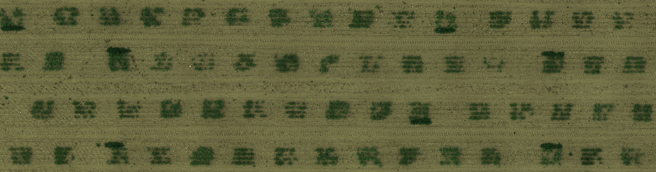
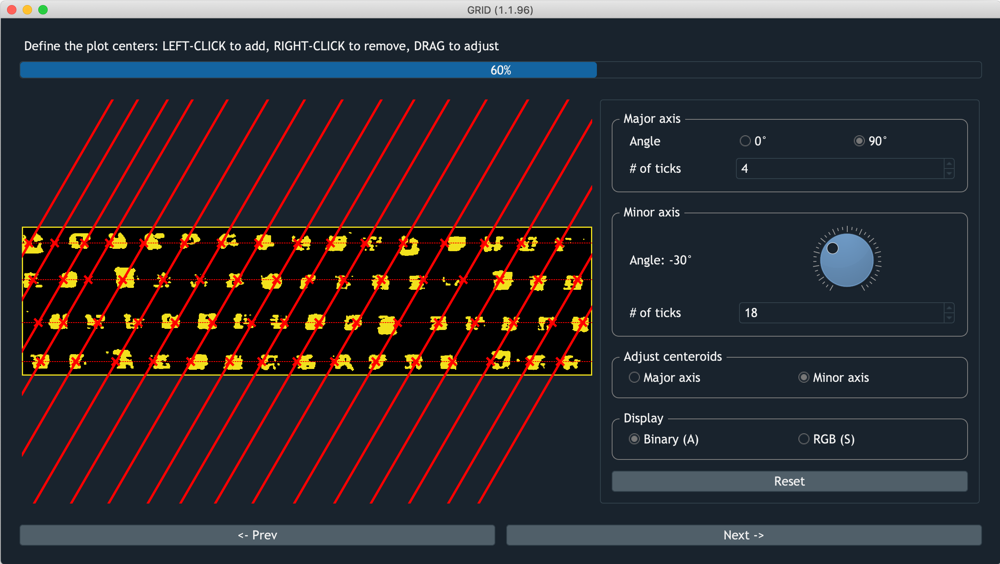
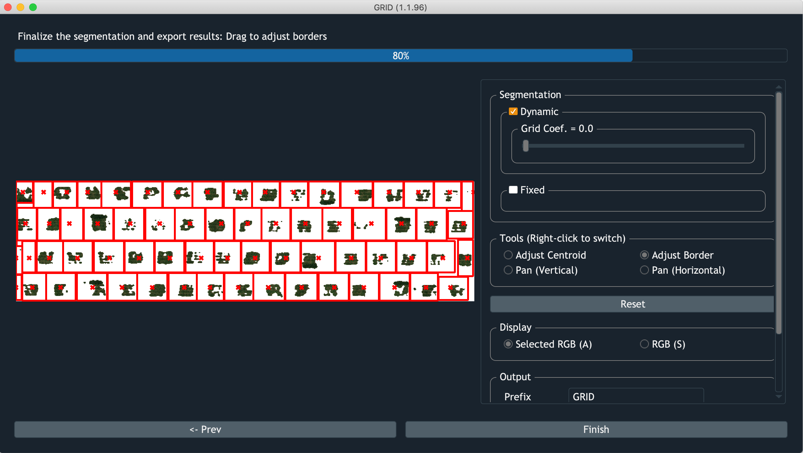

Deal with Arbitrary Field Layout
===================================

    Example of an arbitrary layout

An arbitrary field layout is a type of plot arrangement that 
there's no consistant number of plots exisitng in a row/column.
To deal with such scenario, users have to additionally 
assign centroids for the extra plots. Make sure **every plot** in the 
image get assigned a centroid, and it's ok to have some centroids 
occupying empty space without plot. 

    The way to define centroids for an arbitrary layout

GRID will automatically detect whether the centroid has plot occupied or not,
shrinking the space of the empty spots and 
expanding borders for ones that really cover plots.

