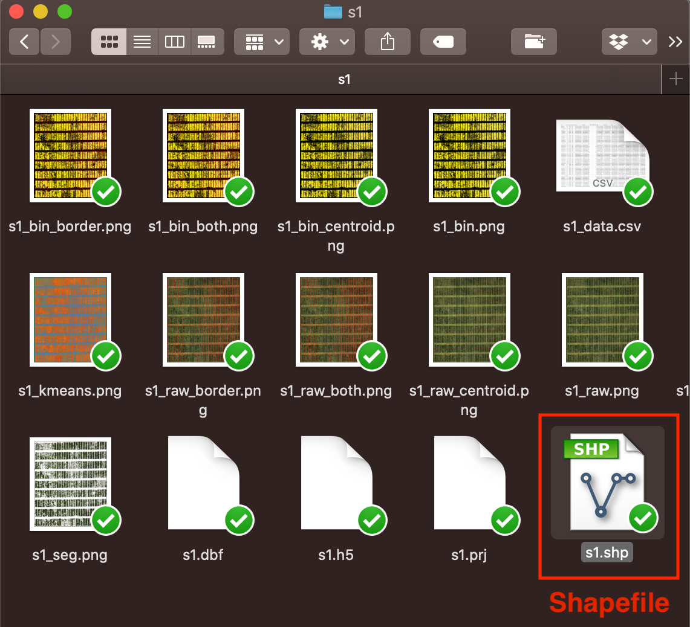
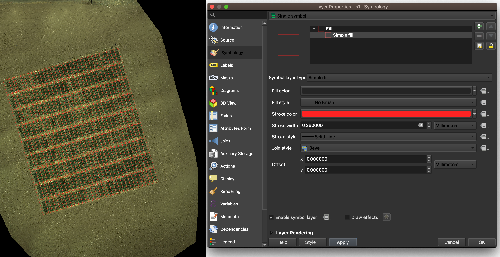
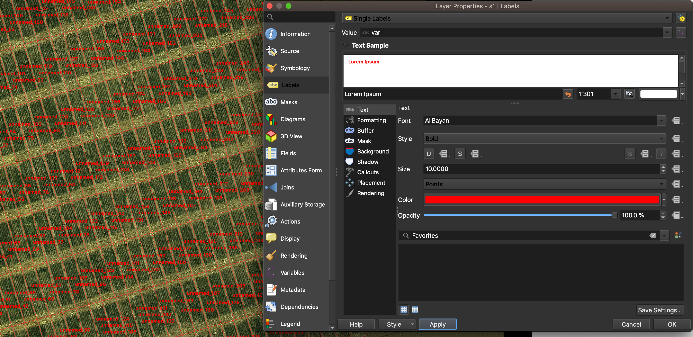
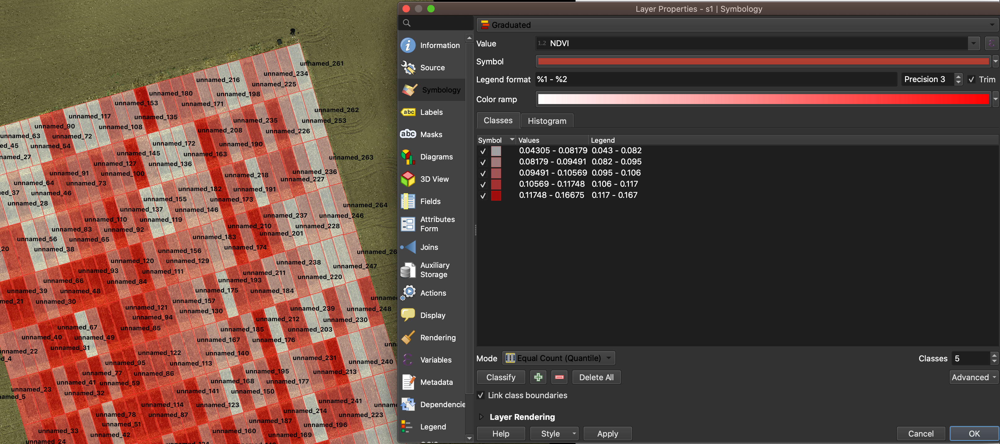

Work with QGIS
==============

QGIS supports Drag and Drop feature to load files. 
You can simply drag the orthoimage into QGIS, 
as well as the shapefile obtained from GRID

Right click on the shapefile layer, and choose ``property`` to define the layer.
In the tab of ``Symbology``, users can design how to show the border.
Our example use red solid line to draw borders without filling any color.

In the tab of ``label``, users can further config the way to show plot IDs.

It's also possible to take advantage of GRID outputs. 
In the tab of ``Symbology``, 
and select ``Graduated`` in the very top drop-down menu.
Then in the drop-down menu of ``Value``, 
select a feature you'd like to visualize.
In this example, we use NDVI as indicators.
Then click ``classify`` button to generate the heat map.

Visualize data in a heatmap allows us to evaluate the spatial variation 
between different plots.

.. figure:: res/qgis/inspect.png
   :align: center
