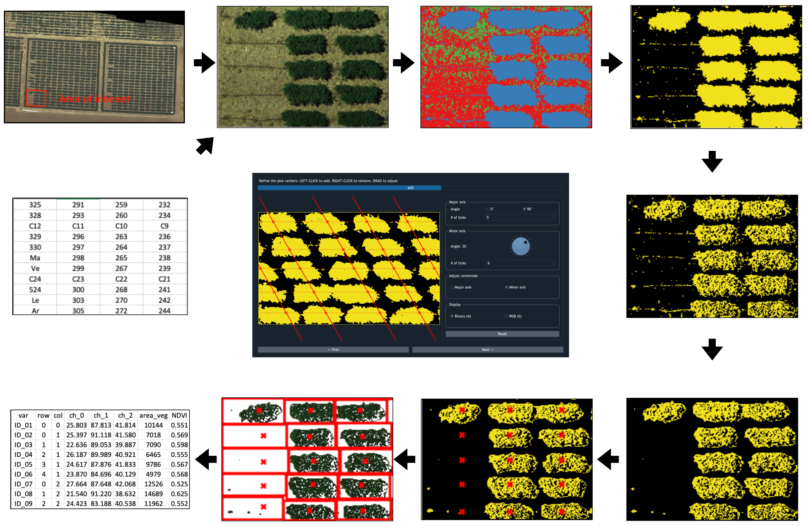

.. GRID documentation master file, created by
   sphinx-quickstart on Thu Jul  9 14:34:18 2020.
   You can adapt this file completely to your liking, but it should at least
   contain the root `toctree` directive.

GRID: Deal with Field Segmentations Elegantly
==========================================================

.. figure:: https://img.shields.io/pypi/dm/photo_grid.svg?label=pypi%20downloads&logo=python&logoColor=white

.. figure:: https://img.shields.io/pypi/v/photo_grid.svg?label=pypi%20version&logo=python&logoColor=white

.. raw:: html

    <a class="github-button" href="https://github.com/poissonfish" data-size="large" data-show-count="true" aria-label="Follow @poissonfish on GitHub">Follow @poissonfish</a>
    <a class="github-button" href="https://github.com/poissonfish/GRID/subscription" data-icon="octicon-eye" data-size="large" data-show-count="true" aria-label="Watch poissonfish/GRID on GitHub">Watch</a>
    <a class="github-button" href="https://github.com/poissonfish/GRID" data-icon="octicon-star" data-size="large" data-show-count="true" aria-label="Star poissonfish/GRID on GitHub">Star</a>
    <a class="github-button" href="https://github.com/poissonfish/GRID/fork" data-icon="octicon-repo-forked" data-size="large" data-show-count="true" aria-label="Fork poissonfish/GRID on GitHub">Fork</a>
    <a class="github-button" href="https://github.com/poissonfish/GRID/issues" data-icon="octicon-issue-opened" data-size="large" data-show-count="true" aria-label="Issue poissonfish/GRID on GitHub">Issue</a>

|

Getting started
----------------

* **Installation**:
  :ref:`Python 3 <Step 1\: Python>` |
  :ref:`Rasterio <Step 2\: Rasterio>` |
  :ref:`PyPI <Step 3\: Install GRID via PyPI>` |
  
* **First-time users**:
  :ref:`Launch GRID` |
  :ref:`Demo mode` |
  :ref:`Work with your images` |

.. toctree::
   :maxdepth: 2
   :hidden:
   :caption: GATTING STARTED

   /ch1_started/installation
   /ch1_started/firsttime

Interface
---------

* **File loading**:
  :ref:`Input files` |
  :ref:`Drag and drop` |

* **Define AOI**:
  :ref:`Draw AOI` |
  :ref:`Adjust AOI` |

* **Define POI**:
  :ref:`K-Means clustering algorithm` |
  :ref:`Binarization` |
  :ref:`Refine POI` |
  :ref:`Display/Zoom` |

* **Detect centroids**:
  :ref:`Major axis` |
  :ref:`Minor axis` |
  :ref:`Centroid adjustment` |

* **Segmentation**:
  :ref:`Dynamic` |
  :ref:`Fixed` |
  :ref:`Fine-tune results` |
  :ref:`Export results` |

.. toctree::
   :maxdepth: 2
   :hidden:
   :caption: INTERFACE

   /ch2_interface/load
   /ch2_interface/aoi
   /ch2_interface/kmeans
   /ch2_interface/centroids
   /ch2_interface/segmentation

Inputs/Outputs
--------------

* **Inputs**:
  :ref:`Images` |
  :ref:`Maps` |
  :ref:`Shapefiles <Shapefiles (inputs)>` |

* **Outputs**:
  :ref:`Tabular results` |
  :ref:`Validation <Images for validations>` |
  :ref:`Shapefiles <Shapefiles (outputs)>` |
  :ref:`NumPy format of AOI` |
  :ref:`H5 dataset` |

.. toctree::
   :maxdepth: 2
   :hidden:
   :caption: INPUTS/OUTPUTS

   /ch3_io/inputs
   /ch3_io/outputs

Advanced usage (Jupyter notebook)
----------------------------------

* :ref:`Customize Vegetation Indices`

* :ref:`Multi-Season Images`

* :ref:`Work with QGIS`

* :ref:`Deal with Arbitrary Field Layout`

* :ref:`Generate datasets for deep learning`

.. toctree::
   :maxdepth: 2
   :hidden:
   :caption: ADVANCED USAGE

   /ch4_adv/custom_index
   /ch4_adv/seasons
   /ch4_adv/qgis
   /ch4_adv/arbitrary
   /ch4_adv/dl

How to cite GRID
-------------------
To cite GRID, you can:

- Import `GRID.bib <https://zzlab.net/GRID/GRID.bib>`_

- or manually key in the following info:

.. code-block:: none

   @article{Chen and Zhang:2020,
    author       = {Chunpeng James Chen and Zhiwu Zhang},
    title        = {GRID: A Python Package for Field Plot Phenotyping Using Aerial Images},
    month        = may,
    year         = 2020,
    journal      = {Remote Sensing},
    volume       = 12,
    issue        = 11,
    pages        = 1697
    doi          = {10.3390/rs12111697},
    url          = {https://doi.org/10.3390/rs12111697}
   }

Support
--------

Find any issue? Post it on 
`GitHub <https://github.com/Poissonfish/GRID/issues>`_ 
or contact `James Chen <mailto:chun-peng.chen@wsu.edu>`_ 